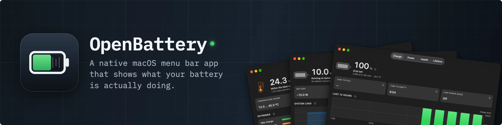

<div align="center">



# 🔋 OpenBattery

**A native macOS menu bar app that shows what your battery is actually doing.**

[](https://github.com/Im-Fran/openbattery/actions/workflows/ci.yml)
[](https://www.apple.com/macos/)
[](https://swift.org)
[](LICENSE)

</div>

---

## 📖 Overview

macOS tells you a percentage. Your battery knows far more than that: how many
milliamp-hours it really holds, how many watts are flowing in and out right now,
how hot it has ever been, and when it was built. All of it sits in the
IORegistry, and none of it is visible without digging.

OpenBattery surfaces that data in the menu bar. It is a SwiftUI app with no
dock icon, no dependencies and no background polling loop — IOKit wakes it when
the power source changes, and the expensive reads only run when something on
screen actually needs them. It idles at about **18 MB** of memory and **0 % CPU**.

Everything comes straight from `AppleSmartBattery` and `AppleSmartBatteryPack`
via IOKit: no root, no privileged helper, no shelling out to `ioreg` or
`pmset`. OpenBattery reads, it does not write — including for the charge limit,
which macOS now handles itself (see [below](#-how-the-charge-limit-works)).

---

## ✨ Features

- **Configurable menu bar** — show or hide the battery icon, and pick which
  fields sit next to it: percentage, time remaining, charging status, battery
  watts, adapter watts, system watts, charge in mAh, temperature. Set it up
  under the gear button → **Menu Bar**.
- **Popover** — charge in % and mAh, time to full or empty, adapter input,
  battery flow and system load in watts, temperature, and Low Power Mode.
- **Battery Info window** — the full picture, four tabs with the same layout,
  charting the charge of the last 12 hours and the capacity retained over the
  last 12 months from readings the app writes down itself (nothing leaves the
  Mac, and gaps show where it was asleep).
- **Charge limit guide** — one click to macOS's own Charge Limit setting.
- **Launch at login** — via `SMAppService`, toggled from the popover.

Fields are joined with a separator in a fixed order, so the layout stays
predictable no matter which order you switch them on:

```
🔋 97% · +8.6 W · 4,991 mAh
```

Anything that is not available right now is skipped rather than shown as a dash —
an unplugged Mac has no adapter watts. Picking watts, mAh or temperature makes
the app read the detailed battery data on a 10 second timer (about 0.2 % CPU);
percentage, time remaining and charging status stay free.

What the Battery Info window shows:

| Group | Fields |
|---|---|
| Charge | percentage and status, mAh of full charge, temperature, time to full, time to empty, Low Power Mode, and the charge level of the last 12 hours |
| Power | adapter input or battery draw, where the power is going, adapter description / rating / V / A, battery watts (signed), voltage, current, and system load over the last 60 seconds |
| Health | health %, full charge against design capacity, cycle count against the rated one, age, nominal capacity, capacity retained over the last 12 months, manufacture date, serial number, gas gauge model |
| Lifetime log | average temperature and how it compares to the ideal range, days recorded, temperature range, voltage range, total operating time, and the peak charge / discharge currents |

Each tab is laid out the same way: one headline reading, three numbers beside
it, and the history or breakdown underneath.

---

## 🛠 Tech Stack

| Layer | Technology |
|-------|-----------|
| Language | Swift 5, deployment target macOS 14 |
| UI | SwiftUI (`MenuBarExtra`, `Window`, `Settings`) |
| Data | IOKit — `IORegistryEntryCreateCFProperty`, `IOPSNotificationCreateRunLoopSource` |
| Login item | ServiceManagement (`SMAppService`) |
| Project generation | [XcodeGen](https://github.com/yonaskolb/XcodeGen) from `project.yml` |
| Tests | XCTest |

---

## 📋 Requirements

- **macOS 14** or newer on **Apple Silicon** (Intel Macs are not supported)
- **Xcode** with the macOS SDK
- **XcodeGen** — `brew install xcodegen`

---

## 🚀 Getting Started

### 1. Clone the repository

```bash
git clone https://github.com/Im-Fran/openbattery.git
cd openbattery
```

### 2. Set your signing team

The app is signed with your own Apple Development certificate. Find your team ID:

```bash
security find-certificate -c "Apple Development" -p | openssl x509 -noout -subject
```

The `OU=` field is your team ID. Put it in `project.yml`:

```yaml
settings:
  base:
    DEVELOPMENT_TEAM: YOUR_TEAM_ID
```

### 3. Build and run

```bash
make run
```

The battery icon appears in the menu bar. There is no dock icon and no window
at launch — the app is an `LSUIElement` agent.

---

## 🏗 Building and Installing

```bash
make build      # build and sign into build/Release/OpenBattery.app
make run        # build, then launch the menu bar app
make install    # copy to /Applications and launch
make test       # unit tests for the raw-value decoding
make uninstall  # remove the app from /Applications
make clean      # drop build/ and the generated Xcode project
```

Every target accepts `XCODEBUILD_FLAGS` for extra `xcodebuild` settings — that is
how CI builds without a signing certificate:

```bash
make test XCODEBUILD_FLAGS='CODE_SIGNING_ALLOWED=NO'
```

`make` regenerates `OpenBattery.xcodeproj` from `project.yml` whenever that file
changes, so the project is never committed.

### With fastlane

The same build and test runs are also available as fastlane lanes, which is the
route to take for release automation (archiving, notarizing, uploading):

```bash
bundle install                      # once, installs fastlane

bundle exec fastlane build          # Release archive → build/OpenBattery.app
bundle exec fastlane test           # unit tests, JUnit report in build/test_output
```

Both lanes regenerate the Xcode project first, and both take `signed:false`
where no signing certificate exists:

```bash
bundle exec fastlane build signed:false
```

### Releasing

Releases run on GitHub Actions and are driven entirely by tags, because
publishing a Release creates a tag too. Every tag does the same thing: archive
with the App Store distribution signature — Apple Distribution plus the
app-store provisioning profile, packaged as a signed `.pkg` — and upload the
result to App Store Connect as a TestFlight build, which is also kept with the
workflow run.

It stops there on purpose. A TestFlight build reaches testers only once someone
promotes it, and reaches the App Store only through a submission made by hand,
so nothing ever ships because a tag was pushed.

The tag carries both version numbers: `<version>+<build>`, with an optional
leading `v`, and a missing `+<build>` means build 1. Nothing in `project.yml`
needs bumping — the tag is passed to the build.

The notarized DMG is not part of the pipeline: its Developer ID certificate
cannot be issued through the App Store Connect API, so that build is a local
lane (see below) and the image is attached to the GitHub Release by hand.

The workflow needs five repository secrets:

| Secret | What it is |
|---|---|
| `ASC_KEY_ID`, `ASC_ISSUER_ID` | the App Store Connect key's identifiers |
| `ASC_KEY_CONTENT` | the `AuthKey_<KEY_ID>.p8`, base64 encoded |
| `MATCH_PASSWORD` | the match repo passphrase (in the login keychain locally) |
| `MATCH_GIT_BASIC_AUTHORIZATION` | base64 of `user:token` for a token that can read `Im-Fran/certificates` |

### Releasing the GitHub build

Run from a machine that holds the Developer ID certificate — this one is not
part of the workflow:

```bash
bundle exec fastlane release_github   # signed, notarized OpenBattery-<version>.dmg
bundle exec fastlane dmg              # repackage the built app, no notarization
```

`release_github` signs with Developer ID, notarizes the app, packages it into a
disk image with the grid background from the landing page, then signs and
notarizes the image too. Both carry a stapled ticket, so a first launch works
offline. Expect Apple to take anywhere from a minute to half an hour.

The version in the file name is read from the built app, so bumping
`MARKETING_VERSION` in `project.yml` is all it takes.

Use the `dmg` lane while adjusting the window: it repackages in seconds instead
of waiting on notarization. `packaging/dmg-background.swift` draws the
background and `packaging/dmg-settings.py` describes the window; the image is
assembled by [dmgbuild](https://dmgbuild.readthedocs.io), run through `uvx` at a
pinned version so nothing is installed permanently.

The obvious route — telling the Finder to `set background picture` over
AppleScript — does not work on current macOS: the assignment raises no error and
never reaches `.DS_Store`, so the image comes out bare. dmgbuild writes
`.DS_Store` itself and sidesteps the Finder entirely.

### Signing certificates (fastlane match)

Certificates and provisioning profiles live encrypted in the private repo
`Im-Fran/certificates`, so a new machine or a CI runner can sign without anyone
exporting a `.p12` by hand:

```bash
bundle exec fastlane certificates            # create or fetch what is missing
bundle exec fastlane certificates readonly:true   # fetch only, never create
```

It needs `fastlane/.env` (copy `fastlane/.env.example`) with the App Store
Connect key ids, the matching `AuthKey_<KEY_ID>.p8` in
`~/.appstoreconnect/private_keys/`, and the repo passphrase. On the machine that
set it up the passphrase comes from the login keychain automatically; read it
with:

```bash
security find-generic-password -s fastlane-match-openbattery -w
```

Elsewhere — CI included — pass it as `MATCH_PASSWORD`.

**Developer ID is the exception.** Apple does not let an App Store Connect API
key create a Developer ID certificate; only the Account Holder can, signed in
interactively. Create it once in Xcode (Settings → Accounts → Manage
Certificates → **+** → Developer ID Application), then push it into the match
repo:

```bash
bundle exec fastlane match import --type developer_id --skip_certificate_matching true
```

**Name the exported files after the certificate id on the portal** (for example
`23WML9Y2N5.cer` and `23WML9Y2N5.p12`). match looks a stored certificate up by
its file name, so a file called `openbattery.p12` makes every later run fail
with "not available on the Developer Portal". The id is the last path component
of the certificate's URL in the Apple Developer portal, under Certificates.

From then on `fastlane certificates` just fetches it like the rest.

---

## 🔌 How the charge limit works

macOS limits charging by itself, so OpenBattery does not. Expand **Limit
charging** in the popover and it walks you through it, then opens the right pane:

1. Open Battery settings.
2. Click the ⓘ button next to **Charging**.
3. Drag **Charge Limit** to 80, 85, 90 or 95 %.

This used to be the job of third-party tools that wrote SMC keys as root. On
current firmware that door is closed: the charge-limit keys (`bfF0`, `bfD0`,
`bfE0`) answer `kIOReturnNotPrivileged` even to root, because the system owns
them now. Shipping a privileged helper would add a launch daemon, an approval
prompt and a way to strand your battery on a stuck charge gate — to reach a
setting macOS already offers.

---

## 🔍 Notes on the raw values

The gas gauge is not self-describing. Three values needed decoding rather than
reading, and `BatteryDecoding.swift` documents each one:

- **`ManufactureDate`** looks like a huge integer (`57390245359923`) but its
  little-endian bytes are ASCII `DDMMYY`. If that fails, the `YYWW` code inside
  `MfgData` is used instead.
- **Temperatures mix scales inside one dictionary**: centi-Celsius for the live
  reading, deci-Celsius for the lifetime average, plain Celsius for the lifetime
  range. OpenBattery picks the scale by magnitude and rejects impossible values.
- **`TotalOperatingTime` has no documented unit.** It is read as hours, and the
  raw sample counter is shown beside it so a wrong assumption stays visible
  rather than becoming a confident lie.

These are exactly what `make test` covers, with fixtures taken from real
hardware.

---

## 📁 Project Layout

```
project.yml                     XcodeGen project definition
Makefile                        build · test · run · install
Sources/OpenBattery/
  OpenBatteryApp.swift          @main scene: MenuBarExtra + info window
  BatteryReader.swift           IORegistry reads (quick and detailed)
  BatteryDecoding.swift         pure decoding, shared with the tests
  BatterySnapshot.swift         one immutable reading, plus derived values
  BatteryMonitor.swift          IOKit notifications, refresh policy
  Formatting.swift              display formatting
  MenuBarConfig.swift           which fields the menu bar shows
  Views/                        menu bar label, popover, info window
Tests/                          decoding and menu bar configuration
```

---

## 🤝 Contributing

Contributions are welcome. Quick workflow:

1. Fork the repo
2. Create a branch: `git checkout -b feat/your-feature`
3. Make sure `make test` passes
4. Commit using [Conventional Commits](https://www.conventionalcommits.org):
   `git commit -m "feat: add your feature"`
5. Push and open a PR

If you are adding a field, decode it in `BatteryDecoding.swift` and cover it
with a test — the raw values are full of traps.

---

## 📄 License

This project is licensed under the **MIT License** — see the [LICENSE](LICENSE)
file for details.

---

<div align="center">
Made with ☕ by <a href="https://fsolism.cl">Fran</a>
</div>
